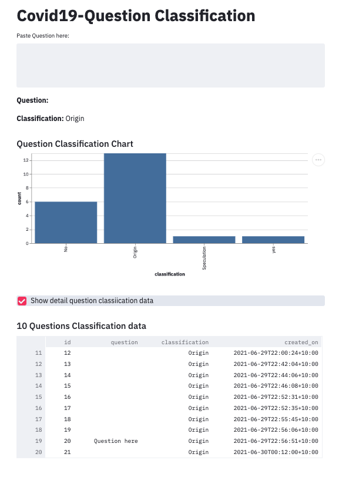
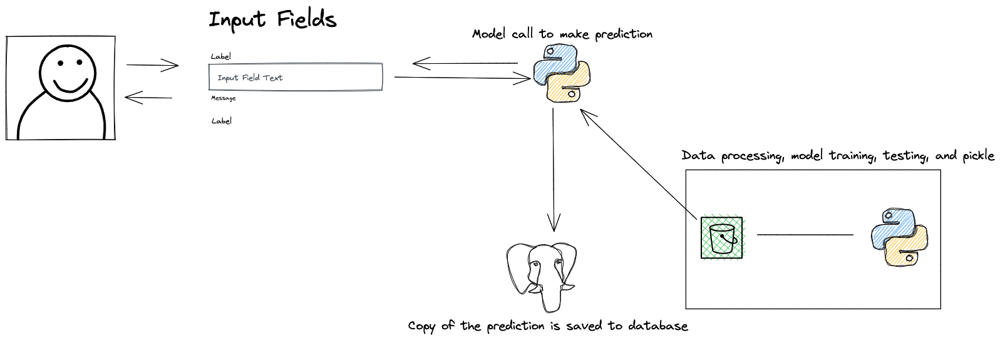

### Covid19 Question Classification
1. Simple tool that could help Call Centre to direct customers to the right departtment based on customers questions.  
2. The app using Ml to quickly provide the category the customer question. One of the key benefit of the app is  enhance call centre in resonding to customer requests. 

### The App



### Simple Design Solution




## How to build and deploy the application
---

### 1. Setup Environment 
Ensure Poetry and python >=3.8.5 are install. You can also install Pyenv to help creating virtualenv with version of python you want. For example, Clone the repo and change to the directory and:
```shell
make install-env
```
Optional:
```shell
pyenv virtualenv 3.8.5 covid19-question-classification
pyenv local covid19-question-classification
```
### 2. Install package dependencies 
```shell
make install-dep
```

#### 3. Data Preparation before Training 
Need to data_prep.py or Makefile to specify to location to read from and to write to. Cloud location like s3 is preferred.
```shell
make data-prep
```

### 4. Train the model
Need to specific the location to read data from and location to write to. Cloud location like s3 is preferred.
```shell
make train
```

### 5. Deploy 
Need to edit main.py to suit your deployment.
```shell
make deploy
```

## Future Plans
---
1. Labelling api would be built as part of application
2. Monitoring would be setup to accommodate for data observability, concept shift, A/B and so on.